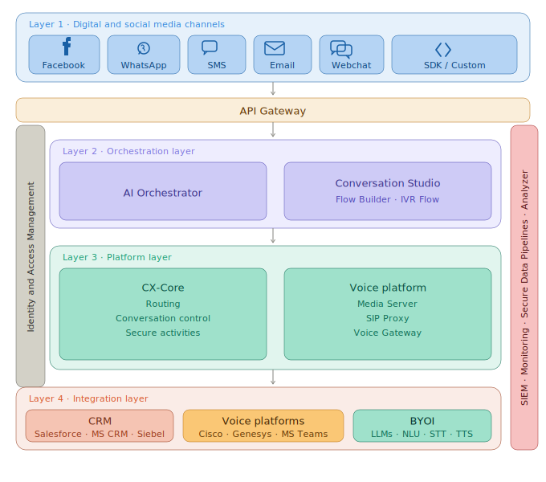

# CX Platform Architecture

A layered contact centre platform spanning digital channel ingestion, AI-driven orchestration, core platform services, and third-party integrations.
Cross-cutting concerns (SIEM, monitoring, secure data pipelines, and analytics) run across all layers.

---

## Diagram

---

## Layer Reference

| # | Layer | Components |
|---|-------|------------|
| 1 | Digital and Social Media Channels | Facebook, WhatsApp, SMS, Email, Webchat, SDK / Custom |
| — | API Gateway | Single entry point — auth, rate limiting, SSL termination, routing |
| 2 | Orchestration | AI Orchestrator, Conversation Studio (Flow Builder, IVR Flow) |
| 3 | Platform | CX-Core, Voice Platform — governed by Identity and Access Management |
| 4 | Integration | CRM (Salesforce, MS CRM, Siebel) · Voice Platforms (Cisco, Genesys, MS Teams) · BYOI (LLMs, NLU, STT, TTS) |

---

## Cross-Cutting Concerns

Span all layers — not specific to any single tier.

| Concern | Responsibility |
|---------|----------------|
| SIEM | Security event collection and alerting |
| Monitoring | Infrastructure and application health |
| Secure Data Pipelines | Encrypted, auditable data transport |
| Analyzer | Reporting, observability, BI dashboards |

---

## Component Notes

### Layer 2 · Orchestration
- **AI Orchestrator** — Routes requests to the appropriate AI model or workflow. Stateless coordinator between channels and platform services.
- **Conversation Studio** — Visual flow designer for conversation trees and IVR. No coding required for flow changes.

### Layer 3 · Platform
- **CX-Core** — Stateful conversation engine. Handles routing logic, session control, and execution of secure activities (e.g. payment capture).
- **Voice Platform** — Real-time voice session management. SIP Proxy handles carrier interconnect; Voice Gateway bridges SIP to internal services.
- **Identity and Access Management** — Spans the full platform layer. All CX-Core and Voice Platform calls are authenticated here.

### Layer 4 · Integration
- **CRM** — Read/write access to customer records. Salesforce is primary; MS CRM and Siebel supported via adapter pattern.
- **Voice Platforms** — Federation layer for external voice infrastructure. Cisco and Genesys for on-prem; MS Teams for cloud voice.
- **BYOI (Bring Your Own AI)** — Pluggable AI provider interface. Swap LLM, NLU, STT, or TTS vendors without platform changes.
