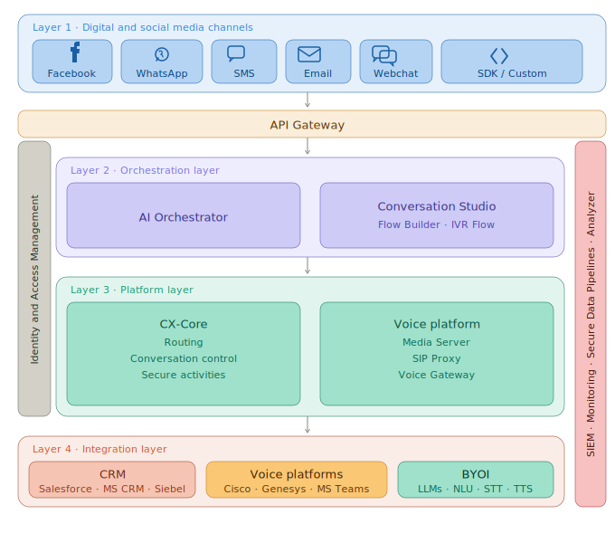

ExpertFlow CX is a cloud-native contact centre platform built on **Kubernetes**. It spans digital channel ingestion, AI-driven orchestration, core platform services, and third-party integrations — with cross-cutting concerns (security, monitoring, analytics) running across every layer.

---

## Platform Overview



| # | Layer | Components |
|---|-------|------------|
| 1 | Digital and Social Media Channels | Facebook, WhatsApp, SMS, Email, Webchat, SDK / Custom |
| — | API Gateway | Single entry point — auth, rate limiting, SSL termination, routing |
| 2 | Orchestration | AI Orchestrator, Conversation Studio (Flow Builder, IVR Flow) |
| 3 | Platform | CX-Core, Voice Platform — governed by Identity and Access Management |
| 4 | Integration | CRM (Salesforce, MS CRM, Siebel) · Voice Platforms (Cisco, Genesys, MS Teams) · BYOI (LLMs, NLU, STT, TTS) |

### Cross-Cutting Concerns

Span all layers — not specific to any single tier.

| Concern | Responsibility |
|---------|----------------|
| SIEM | Security event collection and alerting |
| Monitoring | Infrastructure and application health |
| Secure Data Pipelines | Encrypted, auditable data transport |
| Analyzer | Reporting, observability, BI dashboards |

---

## Layer Reference

### Layer 2 · Orchestration

- **AI Orchestrator** — Routes requests to the appropriate AI model or workflow. Stateless coordinator between channels and platform services.
- **Conversation Studio** — Visual flow designer for conversation trees and IVR. No coding required for flow changes.

### Layer 3 · Platform

- **CX-Core** — Stateful conversation engine. Handles routing logic, session control, and execution of secure activities (e.g. payment capture).
- **Voice Platform** — Real-time voice session management. SIP Proxy handles carrier interconnect; Voice Gateway bridges SIP to internal services.
- **Identity and Access Management** — Spans the full platform layer. All CX-Core and Voice Platform calls are authenticated here.

### Layer 4 · Integration

- **CRM** — Read/write access to customer records. Salesforce is primary; MS CRM and Siebel supported via adapter pattern.
- **Voice Platforms** — Federation layer for external voice infrastructure. Cisco and Genesys for on-prem; MS Teams for cloud voice.
- **BYOI (Bring Your Own AI)** — Pluggable AI provider interface. Swap LLM, NLU, STT, or TTS vendors without platform changes.

---

## Microservices Topology

The platform is composed of loosely coupled services, each owning a specific domain:

| Service | Responsibility |
| ------- | -------------- |
| **CIM (Customer Interaction Manager)** | Central message broker. All interaction events (incoming, transferred, closed) flow through CIM as structured event objects. |
| **Routing Engine** | Evaluates routing rules, skill matching, and queue priorities. Operates in push (precision) or pull (list) mode. |
| **Agent Desk / AgentManager** | WebSocket-based real-time UI server. Maintains per-agent session state and pushes events to browser clients. |
| **AI Orchestrator** | Decoupled reasoning layer. Receives conversation context from CIM and dispatches to configured LLM/NLU providers. Returns enriched results without blocking the interaction flow. |
| **Keycloak (IAM)** | Identity and access management. Issues JWTs for all service-to-service and user authentication. Each tenant gets an isolated realm. |
| **Unified Admin** | Configuration service. Manages queues, skills, channels, teams, and license assignments. Writes directly to MongoDB config collections. |
| **Quality Management** | Evaluation pipeline. Receives transcripts from CIM, assigns to human evaluators or AI audit jobs. |
| **Reporting / CX Analyser** | Reads from MongoDB replica sets and/or OpenSearch indexes to serve real-time dashboards and historical aggregations. |

Services communicate over **REST** (synchronous) and **Redis Pub/Sub** (asynchronous event streams). There is no shared database between services — each owns its own collection namespace within MongoDB.

---

## Data Tier

```text
┌─────────────────────────────────────────┐
│              MongoDB (Primary Data)      │
│  - Config (queues, skills, channels)    │
│  - Interaction records & transcripts    │
│  - Audit & QM results                   │
│  - Replica set recommended for HA       │
└─────────────────────────────────────────┘

┌─────────────────────────────────────────┐
│         Redis (Real-time State)          │
│  - Agent presence & availability        │
│  - Active interaction state             │
│  - Pub/Sub event bus between services   │
│  - Supports Redis Cluster for HA        │
└─────────────────────────────────────────┘

┌─────────────────────────────────────────┐
│      Minio / Blob Storage (Objects)      │
│  - Call recordings                      │
│  - Screen recordings                    │
│  - Channel icons, tenant logos          │
│  - Compatible with AWS S3 API           │
└─────────────────────────────────────────┘
```

MongoDB replica sets (minimum 3 nodes: 1 primary, 2 secondaries) are the recommended production configuration. Redis Cluster mode with sentinel is supported for environments requiring sub-second failover on the real-time event bus.

---

## AI Orchestration

The AI layer is intentionally **decoupled from the interaction path**. A slow or unavailable AI provider never delays or blocks a live customer conversation.

```text
Customer Interaction
       │
       ▼
    CIM Service  ──► (async) ──► AI Orchestrator
       │                              │
       ▼                              ▼
  Agent Desk               LLM Router (configurable)
  (real-time)             ┌──────────────────────────┐
                          │  OpenAI  │ Gemini │ Ollama│
                          │  Rasa    │Dialogflow│ etc. │
                          └──────────────────────────┘
```

The AI Orchestrator exposes a provider-agnostic interface. Operators configure which LLM or NLU engine to use per use case (agent assist, bot routing, quality scoring) without modifying any other service. This is the "Bring Your Own AI" capability referenced in product documentation.

---

## Security Architecture

- **Network:** All inter-service communication is TLS-encrypted. mTLS is supported for sensitive service-to-service paths.
- **Identity:** Keycloak enforces OAuth 2.0 / OIDC for all user sessions. Service accounts use client credential grants with short-lived JWTs.
- **Data at rest:** MongoDB and Minio support AES-256 encryption at rest. Encryption keys managed via Kubernetes Secrets (or external KMS such as Vault).
- **Tenant boundary enforcement:** `tenantId` is extracted from the Keycloak JWT on every API request and enforced at the application layer — no cross-tenant data access is possible even from within the cluster.

---

*Related: [Security & Compliance Whitepaper](Security-and-Compliance-Whitepaper.md) · Scalability & Multi-Tenant Hosting (coming soon)*
